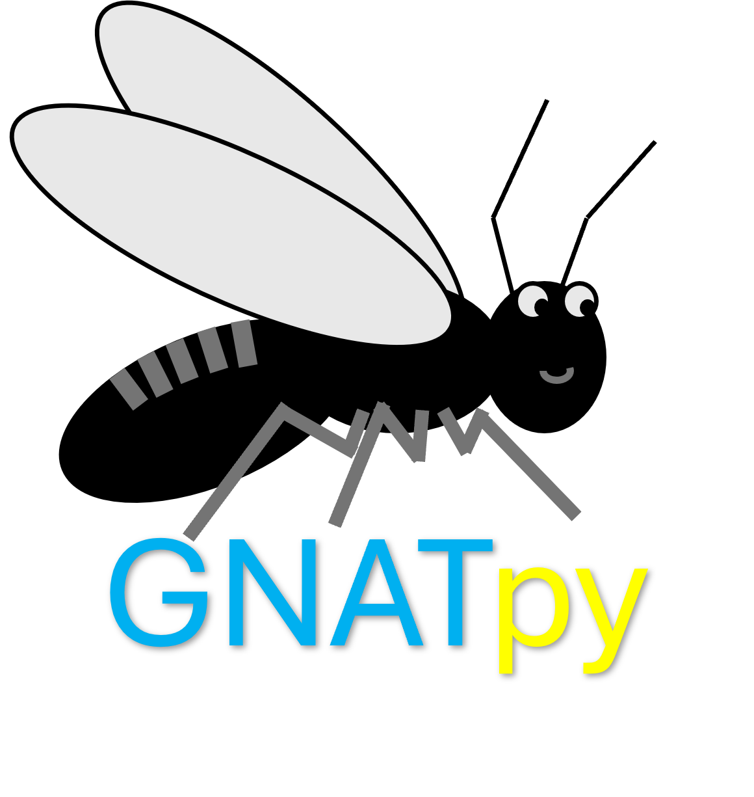

# GNATpy



Welcome to GNATpy, the Gene Network rAnk enTropy python package!
This package includes several methods for analyzing the rank entropy
of a gene network between two different groups of samples.

## Usage

GNATpy can be installed from PyPI with

```{bash}
pip install gnatpy
```

See the [documentation](https://gnatpy.readthedocs.io/en/stable/) for more information

## Licensing

The original code for GNATpy is licensed under an MIT license,
see the LICENSE file for more information.

The code for calculating the Kendall-Tau coefficient in the
src/gnatpy/statistical_utils.py file is modified from [SciPy](https://scipy.org/), licensed under a [BSD-3-Clause license](https://github.com/scipy/scipy/blob/main/LICENSE.txt) (which is reproduced in the LICENSE file), and had a copyright disclaimer that is reproduced in the statistical_utils.py file.

The GNATpy logo is licensed under a [CC0](https://creativecommons.org/publicdomain/zero/1.0/) license.

## References

### DIRAC

- Eddy, J. A., Hood, L., Price, N. D., & Geman, D. (2010). Identifying Tightly Regulated and
  Variably Expressed Networks by Differential Rank Conservation (DIRAC). PLoS Computational
  Biology, 6(5), e1000792.
  [https://doi.org/10.1371/journal.pcbi.1000792](https://doi.org/10.1371/journal.pcbi.1000792)
